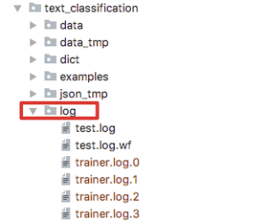

# 网格搜索

- 网格搜索是指在一份配置文件中，每种超参数都可以配置一到多个值，多种超参数之间会进行排列组合，从而形成N份新的配置文件，真正运行的时候会去串行执行这N个配置文件，生成N组模型，这样能通过一次配置和运行，进行多次训练，产出多个模型，提高开发效率。

## 文心中的网格搜索

这里我们以BOW分类任务为例介绍文心中的网格搜索的使用方式，主要分为以下几个步骤：
1. 数据准备：数据集的准备与通用的BOW分类任务一致，不再赘述，详细信息请移步“[快速使用->实战演练：使用文心进行模型训练](https://ai.baidu.com/ai-doc/ERNIE-Ultimate/Ekmlrorrp)”

2. 参数配置：以applications/tasks/text_classification/examples/cls_bow_ch.json为例，假如我们需要对学习率这个参数进行网格搜索设置，那么将”model”中的”learning_rate“的值修改为一个数组即可。目前文心的网格搜索的作用范围在optimization和train_reader的config中，用户可设置多个learning_rate、batch_size和epoch等。修改示例如下：

```
{
  "dataset_reader": {
    "train_reaer": {
        ...
        "config": {
            "data_path": "./data/train_data",
            "shuffle": false,
            "batch_size": [2, 4, 8],   ## 分别以bath_size=2，4，8进行训练
            "epoch": [3, 5],  ## 分别进行3轮和5轮的训练
            "sampling_rate": 1.0
        }
    }
     ...
  },
  "model": {
    "type": "BowClassification",
    "optimization": {
      "learning_rate": [2e-5, 2e-4]   ## learning_rate=2e-5， 2e-4 进行训练
    },
    "vocab_size": 33261,
    "num_labels": 2
  },
   ...
}
```

3. 启动训练：使用网格搜索进行训练的启动脚本与普通训练任务不一样，启动脚本为**run_with_preprocess.py**，该脚本的位置在applications/tools/run_preprocess/目录下，可以拷贝到当前applications/tasks/text_classification目录下使用，入参为上一步骤配置好的json文件，具体如下所示：

```
# BOW 中文文本分类模型
# 基于json实现预置网络训练。其调用了配置文件./examples/cls_bow_ch.json（添加了网格搜索配置的json）
python run_with_preprocess.py --param_path ./examples/cls_bow_ch.json
```

## 运行过程中产生的文件

运行过程：使用**run_with_preprocess.py**启动的添加了网格搜索的任务会产生一些额外的目录，如下所示：

- json_tmp：交叉验证处理完成之后生成的新的待运行配置文件，如下图所示：


- log：基于交run_with_preprocess.py运行的任务都会生成新的json配置，每个json对应一个独立的trainer，各个trainer按照顺序串行训练，所以日志会分别输出到对应编号的log中。如下图就是串行的4个trainer的日志。日志内容和单独运行run_trainer.py输出到test.log中的日志一样，如下图所示：


